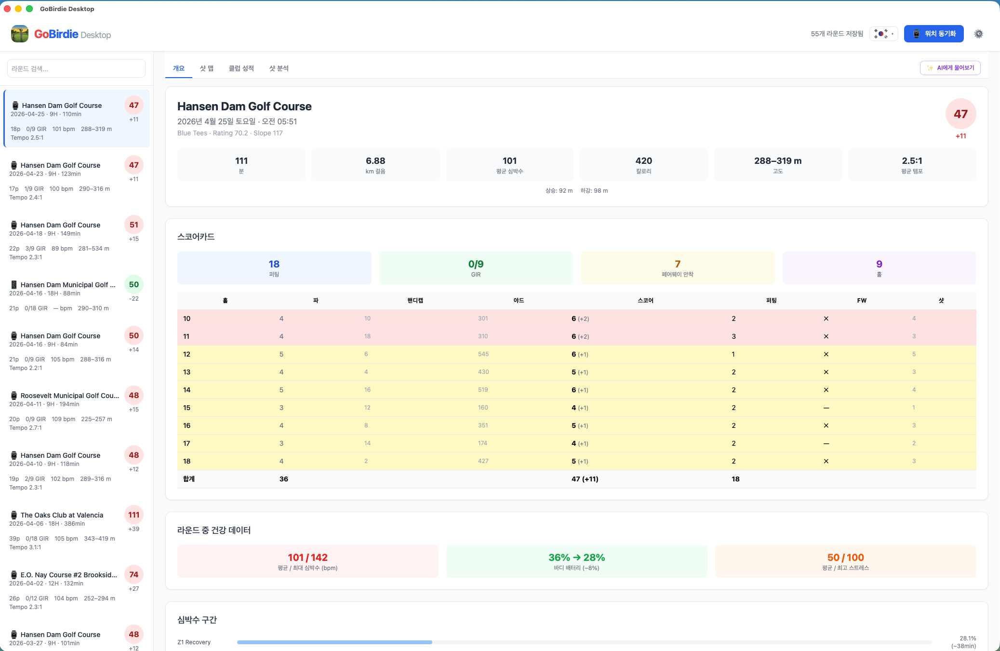
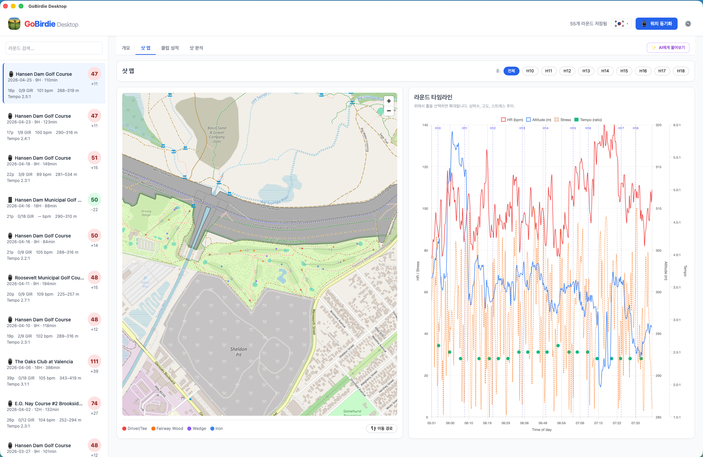
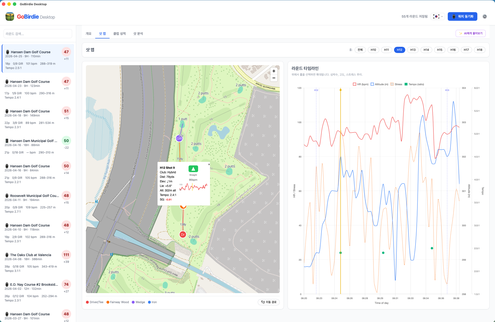
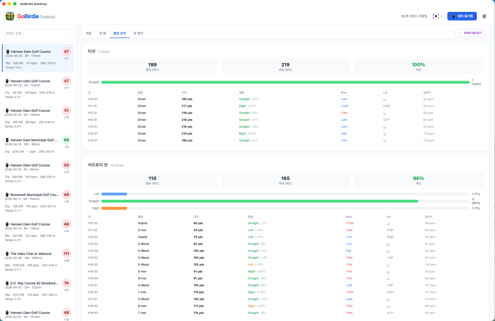
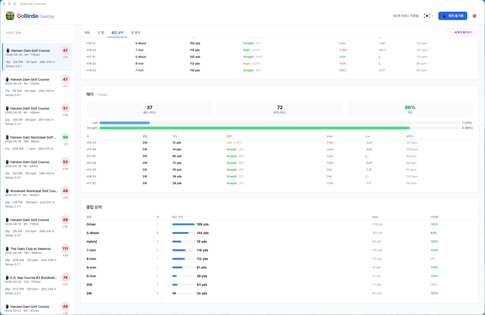
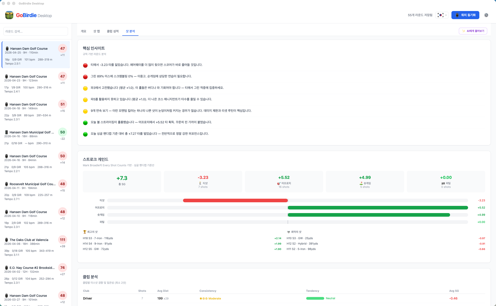
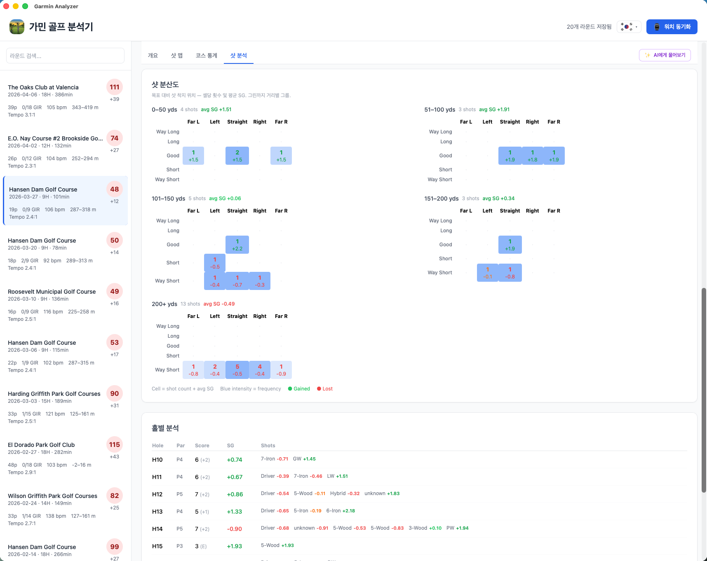
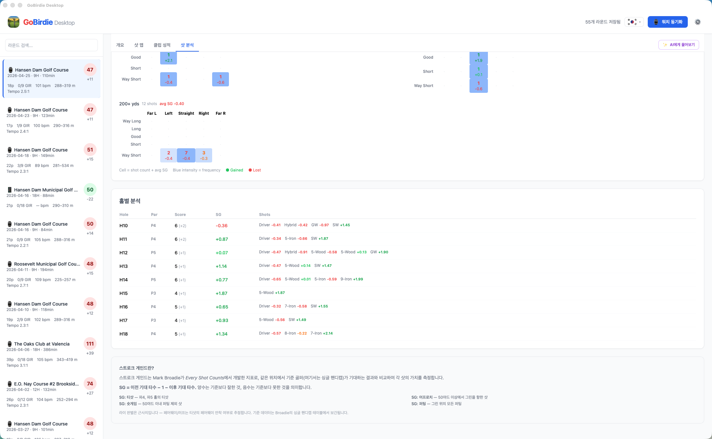
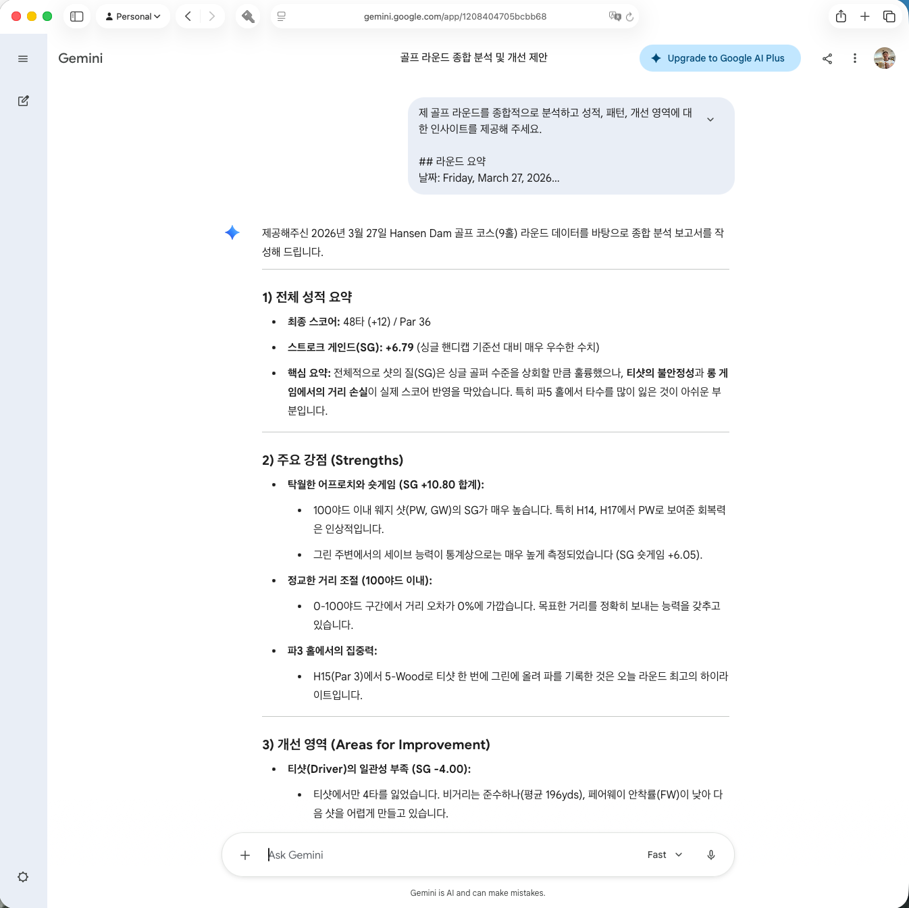

# GoBirdie Desktop

가민, 애플 워치, 안드로이드의 골프 라운드 데이터를 분석하는 데스크탑 앱입니다. Tauri 2, 러스트, 바닐라 자바스크립트로 제작되었습니다.

🇺🇸 [English README](README.md)

## 개요

가민 골프 워치는 라운드당 두 개의 FIT 파일에 골프 활동 데이터를 저장합니다:

- **활동 파일** (`GARMIN/Activity/`) — GPS 경로, 심박수 타임라인, 샷 감지, 건강 지표
- **스코어카드 파일** (`GARMIN/SCORCRDS/`) — 홀별 스코어, 퍼팅, 페어웨이, GIR, 코스 정의

이 앱은 두 파일을 읽고 타임스탬프로 연결하여 골프 성적과 건강 데이터를 통합 표시합니다. 아이폰(로컬 WiFi), 안드로이드(로컬 WiFi + mDNS)에서도 라운드를 동기화할 수 있습니다.

## 기능

### 개요 탭
스코어, 걸은 거리, 칼로리, 평균/최대 심박수, 고도 범위, 평균 스윙 템포를 포함한 라운드 요약. 이글/버디/파/보기 색상 구분, GIR, 페어웨이 안착률이 포함된 홀별 스코어카드와 바디 배터리 소모, 스트레스, 심박수 구간 분석을 보여주는 건강 섹션이 포함됩니다.



### 샷 맵 탭
모든 샷을 클럽 카테고리(드라이버, 페어웨이 우드, 아이언, 웨지, 퍼터)별 색상 선과 점으로 표시하는 인터랙티브 지도. 주요 기능:
- 개별 홀 확대를 위한 홀 선택 버튼
- 각 샷 점 옆에 클럽 약어 라벨
- 각 샷 라인에 야드 거리 표시
- 샷 팝업: 클럽, 거리, 고도 변화(↑/↓), 라이 각도(발 위/아래), 심박수 스파크라인, 스윙 템포, 그린 방향 화살표, 스트로크 게인드
- 라이 각도: Open-Topo-Data NED 10m(미국) / SRTM 30m(전 세계) — 샷 방향 기준 ±10m 수직 지점 고도 측정
- GPS 트레일 토글
- 지도 아래 라운드 타임라인 차트 (심박수, 고도, 스트레스, 스윙 템포)




### 클럽 성적 탭
티샷, 어프로치 샷, 웨지, 퍼팅의 방향 분석(그린 방향 기준 좌/직진/우), 평균/최대 거리, 고도 변화, 라이 각도, 클럽 요약 테이블을 포함한 분석.




### 샷 분석 탭
Mark Broadie의 *Every Shot Counts* 방법론을 기반으로 한 스트로크 게인드 분석. 주요 기능:
- 요약 카드: 총 SG 및 카테고리별 (티샷, 어프로치, 숏게임, 퍼팅)
- 카테고리별 득실 수평 막대 차트
- 최고 및 최악 3개 샷 하이라이트
- 미스샷 경향, 거리 일관성 등급, 클럽별 평균 SG 테이블
- 그린까지 거리 구간별 샷 분산 히트맵
- 샷별 SG 배지가 포함된 홀별 분석 테이블





### 스윙 템포
활동 FIT 파일의 mesg #104에서 5분 이동 평균으로 캡처됩니다. 비율(백스윙:다운스윙)은 라운드 헤더, 타임라인 차트, 샷 팝업에 표시됩니다.

### AI에게 물어보기
✨ AI에게 물어보기 버튼은 모든 라운드 데이터로 종합 마크다운 프롬프트를 생성하여 클립보드에 복사합니다. [Gemini](https://gemini.google.com) 또는 [ChatGPT](https://chatgpt.com)에 바로 붙여넣기할 수 있습니다.



## 다운로드

사전 빌드된 macOS 및 Windows 바이너리는 [릴리스 페이지](https://github.com/nicechester/GoBirdie-Desktop/releases)에서 다운로드할 수 있습니다.

## 동기화 소스

첫 실행 시 기기 유형을 선택합니다:

| 기기 | 동기화 방법 |
|------|------------|
| **가민 워치** | USB 케이블 (macOS: libmtp / Windows: WPD) |
| **애플 워치** | 로컬 WiFi (mDNS) — macOS 전용 |
| **안드로이드** | 로컬 WiFi (mDNS) — GoBirdie 안드로이드 설정에서 동기화 서버 활성화 필요 |

## 빌드

### macOS
```bash
bash build.sh
```

### Windows
```bat
build.bat
```

Visual Studio 2022 C++ 워크로드 및 러스트 툴체인이 필요합니다.

## 아키텍처

```
GoBirdie-Desktop/
├── src-tauri/              러스트 백엔드
│   ├── src/
│   │   ├── main.rs         Tauri 진입점, 커맨드 등록
│   │   ├── models.rs       데이터 구조
│   │   ├── parser.rs       FIT 파일 파싱
│   │   ├── store.rs        Sled 기반 영속성
│   │   ├── mtp.rs          MTP 워치 동기화 (macOS: libmtp / Windows: WPD)
│   │   ├── apple_sync.rs   아이폰 동기화 (MultipeerConnectivity)
│   │   ├── android_sync.rs 안드로이드 동기화 (HTTP + mDNS)
│   │   └── native/
│   │       ├── garmin_mtp.c             macOS libmtp 헬퍼
│   │       └── garmin_mtp_windows.cpp   Windows WPD 헬퍼
│   ├── Cargo.toml
│   └── tauri.conf.json
├── web/                    프론트엔드 (바닐라 JS + Tailwind)
│   ├── index.html
│   └── js/
│       ├── app.js
│       ├── i18n.js
│       ├── nlg-templates.js
│       └── nlg-engine.js
├── build.sh                macOS 빌드 스크립트
├── build.bat               Windows 빌드 스크립트
└── vite.config.js
```

## 다국어 지원

헤더의 국기 기반 언어 토글로 모든 UI 문자열, NLG 인사이트, 날짜 형식을 영어/한국어 간 전환할 수 있습니다. 언어 설정은 `localStorage`에 저장됩니다.
