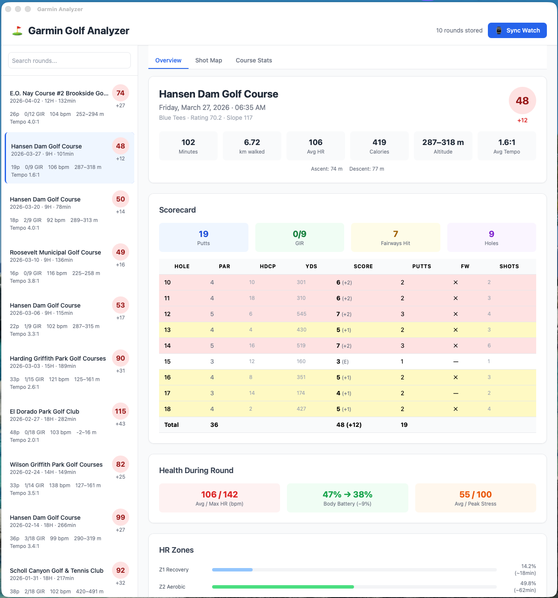
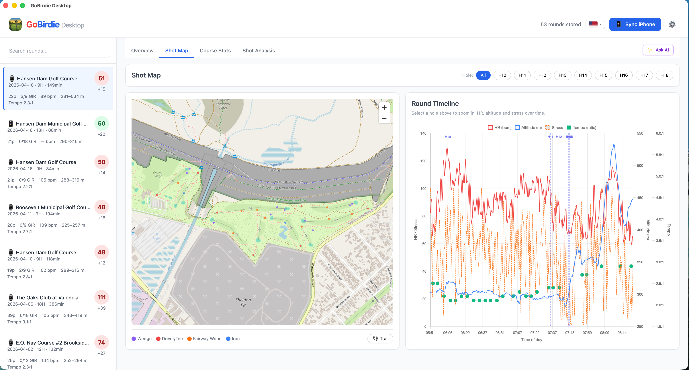
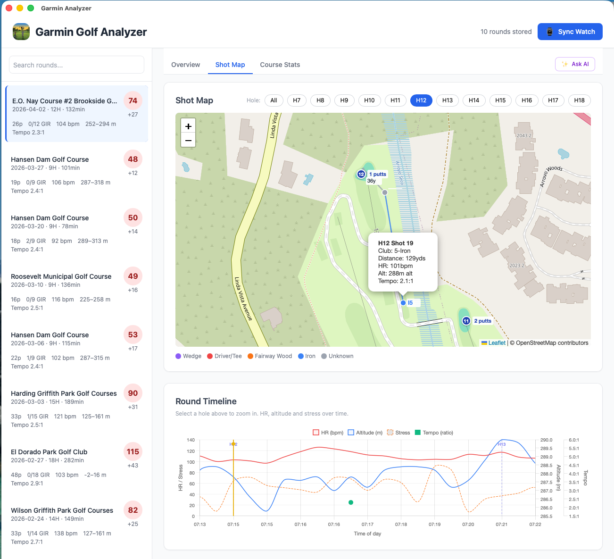
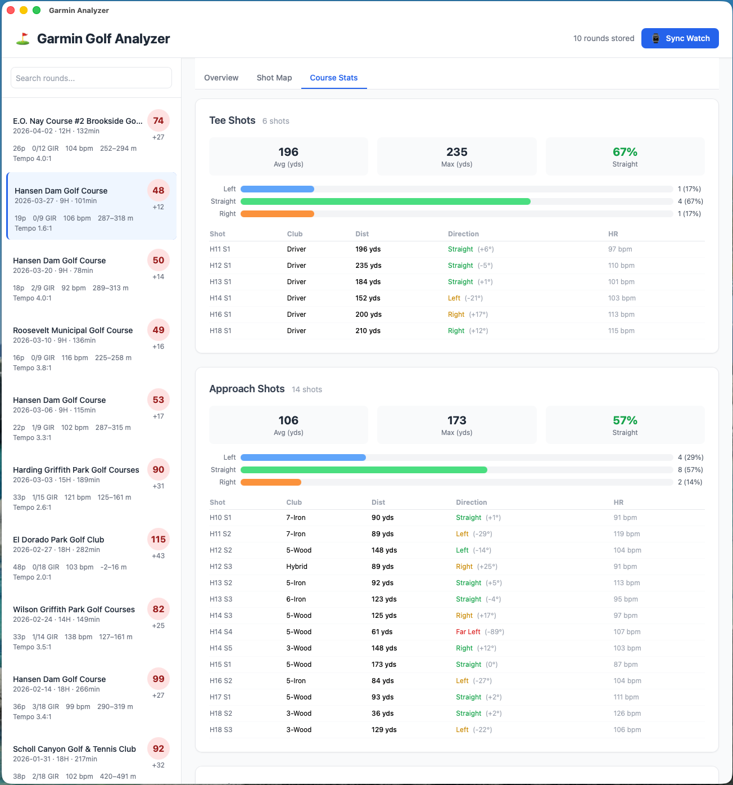
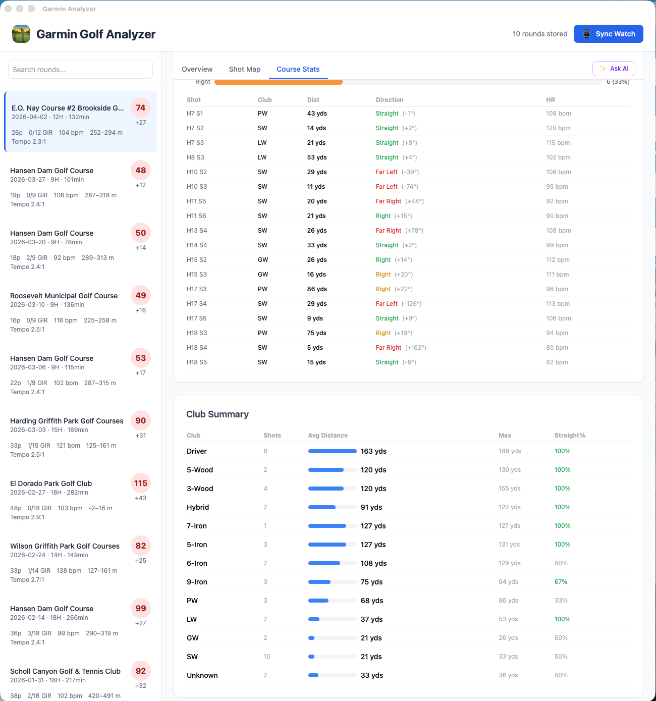
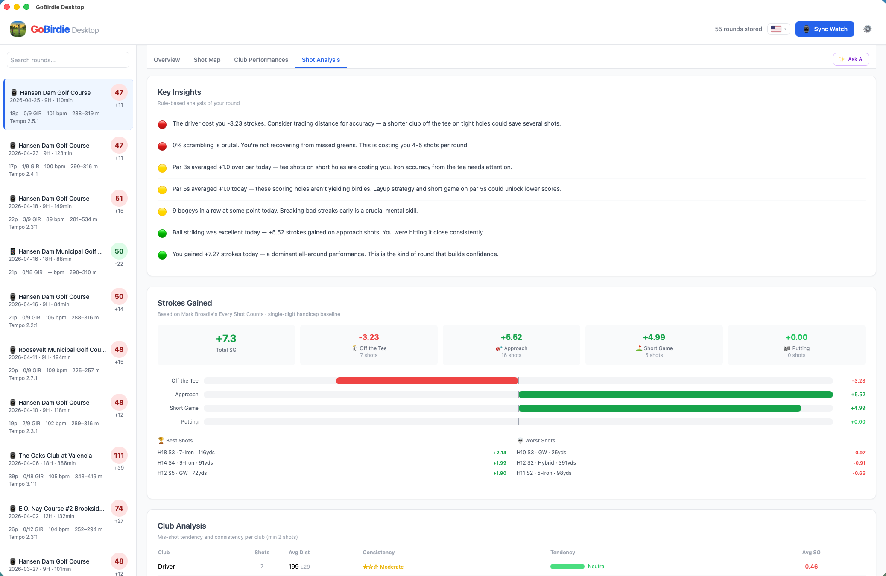
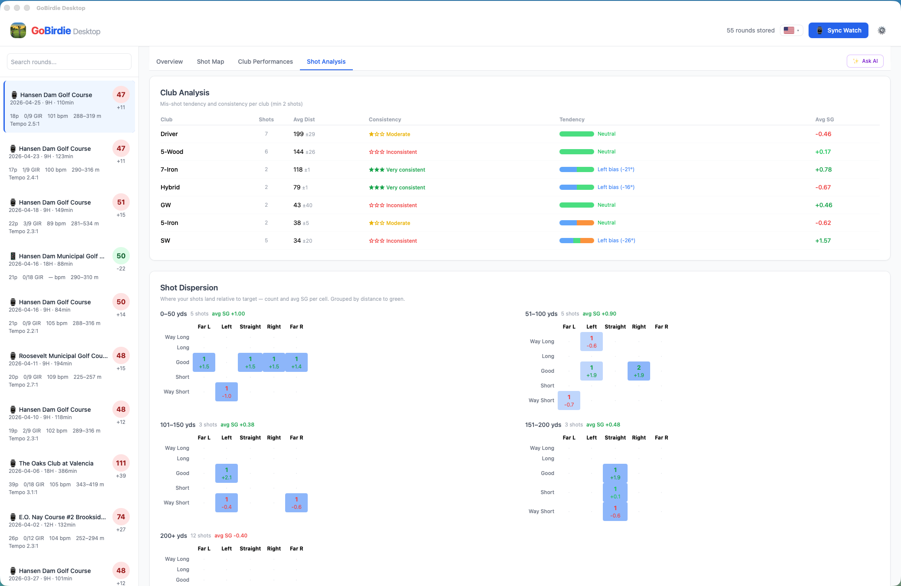
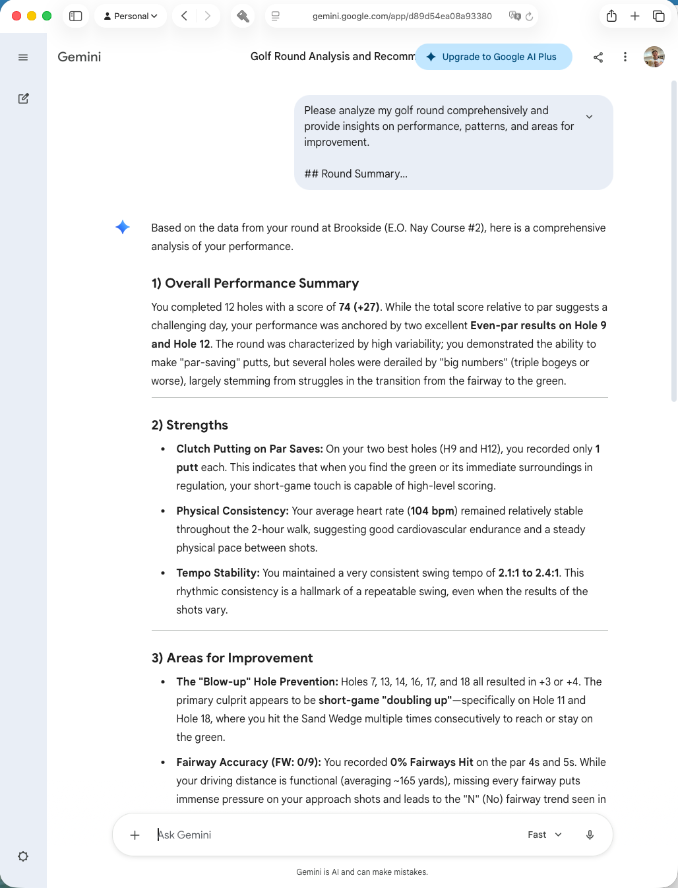

# 가민 골프 분석기

가민 골프 라운드 데이터를 분석하는 데스크톱 애플리케이션입니다. Tauri 2, Rust, 바닐라 JavaScript로 제작되었습니다.

🇺🇸 [English README](README.md)

## 개요

가민 워치는 라운드당 두 개의 FIT 파일에 골프 활동 데이터를 저장합니다:

- **활동 파일** (`GARMIN/Activity/`) — GPS 경로, 심박수 타임라인, 샷 감지, 건강 지표
- **스코어카드 파일** (`GARMIN/SCORCRDS/`) — 홀별 스코어, 퍼팅, 페어웨이, GIR, 코스 정의

이 앱은 두 파일을 읽고 타임스탬프로 연결하여 골프 성적과 건강 데이터를 통합 표시합니다.

## 기능

### 개요 탭
스코어, 걸은 거리, 칼로리, 평균/최대 심박수, 고도 범위, 평균 스윙 템포를 포함한 라운드 요약. 이글/버디/파/보기 색상 구분, GIR, 페어웨이 안착률이 포함된 홀별 스코어카드와 바디 배터리 소모, 스트레스, 심박수 구간 분석을 보여주는 건강 섹션이 포함됩니다.



### 샷 맵 탭
모든 샷을 클럽 카테고리(드라이버, 페어웨이 우드, 아이언, 웨지, 퍼터)별 색상 선과 점으로 표시하는 인터랙티브 Leaflet 지도. 주요 기능:
- 개별 홀 확대를 위한 홀 선택 버튼
- 각 샷 점 옆에 클럽 약어 라벨 (`Dr`, `W3`, `I7`, `PW`, `H` 등)
- 각 샷 라인에 야드 거리 표시
- 각 홀 번호 마커 옆에 퍼팅 수 인라인 표시
- 클럽, 거리, 심박수 스파크라인, 고도, 스윙 템포, 방향 화살표(신호등 스타일), 스트로크 게인드를 보여주는 2열 호버 팝업
- 걸은 경로를 보여주는 GPS 트레일 토글
- 스크롤/더블클릭 줌 비활성화 — `+`/`−` 버튼만 사용
- 지도 아래 홀 마커와 함께 심박수, 고도, 스트레스, 스윙 템포를 시간순으로 보여주는 라운드 타임라인 차트




### 코스 통계 탭
티샷, 어프로치 샷, 웨지, 퍼팅의 방향 분석(좌/직진/우), 평균/최대 거리, 클럽 요약 테이블을 포함한 분석.




### 샷 분석 탭
Mark Broadie의 *Every Shot Counts* 방법론을 기반으로 한 스트로크 게인드 분석 (싱글 핸디캡 아마추어 기준선). 주요 기능:
- 요약 카드: 총 SG 및 카테고리별 (티샷, 어프로치, 숏게임, 퍼팅)
- 카테고리별 득실을 보여주는 수평 막대 차트
- 최고 및 최악 3개 샷 하이라이트
- 미스샷 경향(방향 편향), 거리 일관성 등급(★★★ ~ ☆☆☆), 클럽별 평균 SG를 포함한 클럽 분석 테이블
- 그린까지 거리 구간별(0–50, 51–100, 101–150, 151–200, 200+ 야드) 5×5 방향 × 거리 그리드에 샷 수와 평균 SG를 보여주는 샷 분산 히트맵
- 샷별 SG 배지가 포함된 홀별 분석 테이블




### 스윙 템포
스윙 템포는 활동 FIT 파일의 mesg #104에서 5분 이동 평균으로 캡처됩니다. 비율(백스윙:다운스윙)은 라운드 헤더, 타임라인 차트의 녹색 점, 그리고 가능한 경우 개별 샷 팝업에 표시됩니다.

### AI에게 물어보기
✨ AI에게 물어보기 버튼은 모든 라운드 데이터 — 스코어카드, 샷 상세, 스트로크 게인드, 클럽 분석, 샷 분산 패턴, 스윙 템포, 1분 단위 건강 타임라인(심박수, 고도, 스트레스, 템포) — 로 종합 마크다운 프롬프트를 생성하여 클립보드에 복사합니다. [Gemini](https://gemini.google.com) 또는 [ChatGPT](https://chatgpt.com)에 바로 붙여넣기할 수 있습니다.



### 다국어 지원 (i18n)
헤더의 국기 기반 언어 토글로 모든 UI 문자열, NLG 인사이트, 날짜 형식을 영어/한국어 간 전환할 수 있습니다. 언어 설정은 `localStorage`에 저장됩니다.

## 다운로드

사전 빌드된 macOS 바이너리는 [릴리스 페이지](https://github.com/nicechester/garmin-golf-analyzier/releases)에서 다운로드할 수 있습니다.

## 아키텍처

```
tauri/
├── src-tauri/              Rust 백엔드
│   ├── src/
│   │   ├── main.rs         Tauri 진입점, 커맨드 등록
│   │   ├── models.rs       데이터 구조 (GolfRound, Scorecard, HoleScore 등)
│   │   ├── parser.rs       활동 및 스코어카드 FIT 파일 파싱
│   │   ├── store.rs        Sled 기반 영속성 레이어
│   │   ├── mtp.rs          네이티브 바이너리를 통한 MTP 워치 연결
│   │   └── native/
│   │       ├── garmin_mtp.c    libmtp 헬퍼 C 소스
│   │       └── garmin_mtp      컴파일된 바이너리 (macOS ARM64)
│   ├── Cargo.toml
│   └── tauri.conf.json
├── web/                    프론트엔드 (바닐라 JS + Tailwind)
│   ├── index.html
│   ├── css/main.css
│   └── js/
│       ├── app.js              메인 UI 렌더링 및 이벤트 처리
│       ├── i18n.js             다국어 지원 (EN/KO 번역, 언어 선택기)
│       ├── nlg-templates.js    이중 언어 NLG 인사이트 템플릿 (~35개 규칙)
│       └── nlg-engine.js       규칙 기반 인사이트 엔진
├── package.json
└── vite.config.js
```

## 사전 요구사항

### 시스템 의존성

- macOS (ARM64 또는 x86_64)
- Rust 툴체인 (`rustup`)
- Node.js 18+
- libmtp (`brew install libmtp`)
- Tauri CLI (`npm install -g @tauri-apps/cli`)

### 네이티브 MTP 헬퍼 빌드

`garmin_mtp` 바이너리는 워치와의 USB 통신을 처리합니다. macOS에서 Tauri의 Rust 런타임이 직접 USB 인터페이스를 점유할 수 없기 때문에 별도로 컴파일해야 합니다.

```bash
clang -I/opt/homebrew/include -L/opt/homebrew/lib -lmtp \
  -o src-tauri/src/native/garmin_mtp \
  src-tauri/src/native/garmin_mtp.c
```

## 개발

```bash
cd tauri
npm install
npm run tauri:dev
```

Vite 개발 서버가 포트 9002에서 시작되고 핫 리로드가 적용된 Tauri 윈도우가 실행됩니다.

## 빌드

```bash
npm run tauri:build
```

배포 가능한 앱 번들은 `src-tauri/target/release/bundle/`에 생성됩니다.

## Tauri 커맨드

모든 커맨드는 프론트엔드에서 `@tauri-apps/api/core`의 `invoke()`를 통해 호출됩니다.

| 커맨드 | 설명 |
|--------|------|
| `sync_latest_round` | Android File Transfer를 종료하고, `garmin_mtp`를 실행하여 연결된 워치에서 최신 스코어카드 및 활동 FIT 파일을 다운로드, 파싱 및 연결 후 저장하고 `RoundSummary`를 반환 |
| `import_fit_files(scorecard_paths, activity_paths)` | 명시적 파일 경로에서 대량 가져오기. 스코어카드 파일은 12시간 이내의 티 타임스탬프로 활동 파일과 매칭 |
| `get_all_rounds` | 저장된 모든 `RoundSummary` 객체를 최신순으로 반환 |
| `get_round_detail(id)` | 주어진 ID의 전체 `GolfRound`를 반환 (스코어카드 및 건강 타임라인 포함) |
| `get_clubs` | `Clubs.fit`에서 로드된 모든 `ClubInfo` 항목 반환 |
| `get_store_stats` | `{ round_count }` 반환 |

## 데이터 모델

### GolfRound

활동 및 스코어카드 데이터를 결합한 최상위 레코드.

- `id` — 활동 FIT 파일의 SHA-256 (중복 방지 키)
- `start_ts`, `end_ts` — 가민 에포크 타임스탬프 (Unix 시간 변환: +631065600)
- `duration_seconds`, `distance_meters`, `calories`
- `avg_heart_rate`, `max_heart_rate`, `total_ascent`, `total_descent`
- `shots` — 활동 파일 mesg #325의 `Vec<GolfShot>`
- `health_timeline` — Record 메시지의 `Vec<HealthSample>` (~3-5초당 1개)
- `scorecard` — SCORCRDS FIT 파일의 `Option<Scorecard>`

### Scorecard

SCORCRDS FIT 파일의 가민 독점 메시지에서 파싱.

| 메시지 | 내용 |
|--------|------|
| #190 | 라운드 요약: 코스명, 파, 티 색상, 코스 레이팅, 슬로프 |
| #191 | 플레이어 요약: 총 스코어, 퍼팅, GIR, 페어웨이 안착 |
| #192 | 홀별 스코어: 홀 번호, 스코어, 퍼팅, 페어웨이 안착 플래그 |
| #193 | 홀 정의: 파, 핸디캡, 거리, 티 GPS 위치 |
| #194 | 샷 위치: 출발/도착 GPS 좌표, 클럽 ID |

### ClubInfo

워치의 `GARMIN/Clubs/` 폴더에 있는 `Clubs.fit` (mesg #173)에서 파싱.

| 필드 | 설명 |
|------|------|
| `club_id` | 불투명 `u64` 식별자 — `ShotPosition`의 `club_id`와 매칭 |
| `club_type` | `ClubType` 열거형 (Driver, 3-Wood, 5-Iron, PW, SW, Putter 등) |
| `name` | `ClubType`에서 파생된 표시 이름 (예: `"7-Iron"`, `"SW"`) |
| `avg_distance_cm` | 워치가 기록한 평균 캐리 거리 (센티미터) |

`ClubType`은 가민의 내부 열거형 값(mesg #173의 필드 `f2`)을 명명된 변형으로 매핑합니다. `category()`는 코스 통계 탭에서 사용하는 그룹 문자열을 반환합니다:

| 카테고리 | 클럽 유형 |
|----------|-----------|
| `tee` | 드라이버 |
| `fairway_wood` | 3/5/7-우드, 하이브리드 |
| `iron` | 2–9 아이언 |
| `wedge` | PW, GW, SW, LW |
| `putt` | 퍼터 |

클럽은 시작 시 `garmin_mtp`가 반환하는 `clubs_path` JSON 필드의 경로에서 한 번 로드됩니다. `AppState.clubs`에 저장되며 각 라운드 파싱 후 `enrich_shots()`에 전달됩니다.

### HealthSample

활동 FIT 파일의 Record 메시지당 하나의 샘플.

- `heart_rate` — bpm
- `stress_proxy` — 필드 #135, 0-100 (가민 독점 스트레스 지표)
- `body_battery` — 필드 #143 (가민 바디 배터리 레벨)
- `altitude_meters` — enhanced_altitude 필드에서 추출
- `position` — 세미서클에서 변환된 GPS 좌표

## 영속성

라운드는 [sled](https://github.com/spacejam/sled) 임베디드 데이터베이스에 저장됩니다:

```
~/Library/Application Support/garmin-analyzer/rounds.db
```

각 라운드의 키는 활동 FIT 파일의 SHA-256 해시로, 동일한 파일이 여러 번 처리되어도 중복 가져오기를 방지합니다.

## MTP 워치 연결

`garmin_mtp` 바이너리는 libmtp를 사용하여:

1. USB를 통해 가민 워치 감지
2. `GARMIN/SCORCRDS/`의 파일 목록 조회 — 가장 높은 파일 ID(최신 스코어카드) 찾기
3. `GARMIN/Activity/`의 파일 목록 조회 — 스코어카드와 `modificationdate`가 일치하는 활동 찾기
4. `GARMIN/Clubs/`에서 `Clubs.fit` 다운로드 — 클럽 정의 (이름, 유형, 평균 거리)
5. 스코어카드와 활동 파일을 임시 디렉토리에 다운로드
6. `clubs_path`를 포함한 파일 경로와 메타데이터가 담긴 JSON 객체를 stdout으로 출력

동기화 시 Android File Transfer가 실행 중이면 안 됩니다. 앱이 바이너리 호출 전에 자동으로 종료합니다.

## 알려진 제한사항

- macOS 전용. `garmin_mtp` 바이너리는 Tauri 프로세스가 직접 얻을 수 없는 macOS USB 접근이 필요한 libmtp를 사용합니다.
- `garmin_mtp` 바이너리 경로는 컴파일된 실행 파일 기준 상대 경로로 해석됩니다. 개발 모드에서는 `src-tauri/src/native/garmin_mtp`를 찾습니다.
- 스코어카드 데이터(홀별 스코어, 퍼팅, GIR)는 메인 활동 FIT 파일이 아닌 SCORCRDS 폴더의 가민 독점 메시지 유형(#190-194)에 저장됩니다.
- 가민 FIT 에포크는 1989년 12월 31일에 시작됩니다. FIT 파일의 모든 타임스탬프는 Unix 시간으로 변환하려면 631065600을 더해야 합니다.

## 의존성

### Rust

| 크레이트 | 용도 |
|----------|------|
| `tauri 2` | 데스크톱 앱 프레임워크 |
| `fitparser 0.10` | FIT 파일 파싱 |
| `sled 0.34` | 임베디드 키-값 저장소 |
| `serde / serde_json` | 직렬화 |
| `chrono` | 타임스탬프 포맷팅 |
| `sha2 / hex` | 중복 방지를 위한 파일 해싱 |
| `dirs` | 플랫폼 데이터 디렉토리 |

### JavaScript

| 패키지 | 용도 |
|--------|------|
| `@tauri-apps/api` | Rust 커맨드용 `invoke()` |
| `vite` | 개발 서버 및 번들러 |
| Tailwind CSS (CDN) | 스타일링 |
