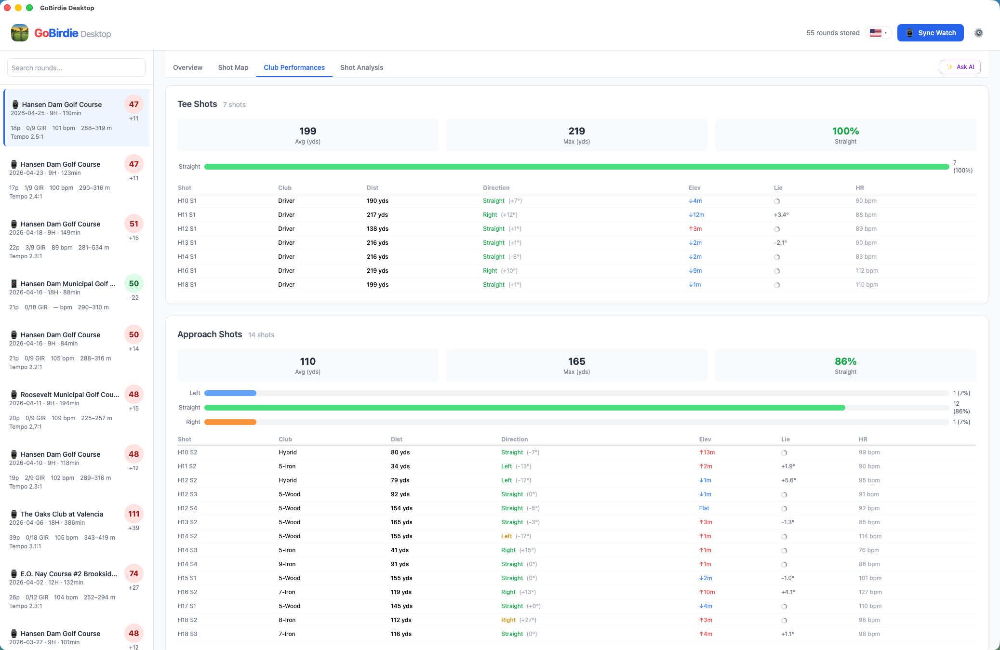
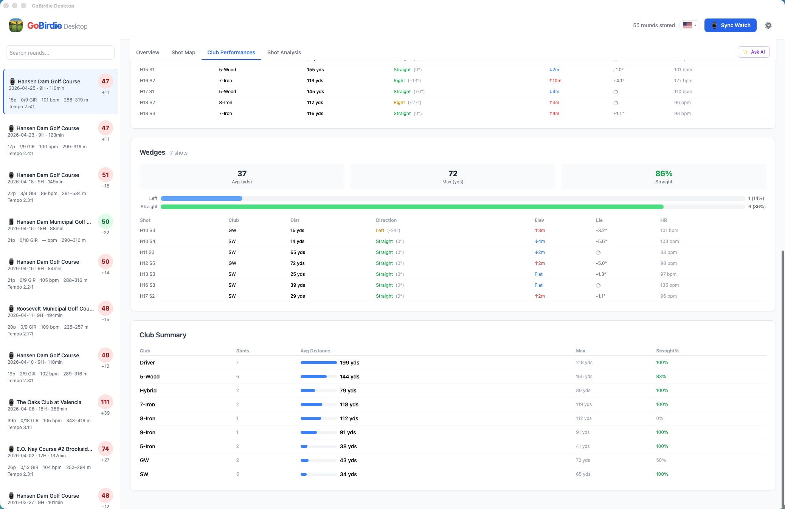
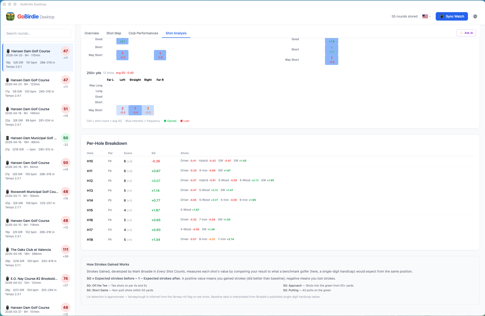

# GoBirdie Desktop

A desktop app for analyzing golf round data from Garmin, Apple Watch, and Android. Built with Tauri 2, Rust, and vanilla JavaScript.

🇰🇷 [한국어 README](README.ko.md)

## Overview

Garmin watches store golf activity data in two separate FIT files per round:

- **Activity file** (`GARMIN/Activity/`) — GPS track, heart rate timeline, shot detections, health metrics
- **Scorecard file** (`GARMIN/SCORCRDS/`) — per-hole scores, putts, fairways, GIR, course definition

This app reads both files, links them by timestamp, and presents a combined view of golf performance and health data. It also syncs rounds from iPhone (via local WiFi) and Android (via local WiFi + mDNS).

## Features

### Overview Tab
Round summary with score, distance walked, calories, avg/max HR, altitude range, and avg swing tempo. Includes a hole-by-hole scorecard with color-coded results (eagle/birdie/par/bogey), GIR, fairways hit, and a health section showing Body Battery drain, stress, and HR zone breakdown.


### Shot Map Tab
Interactive map showing every shot as a colored line and dot, color-coded by club category (Driver, Fairway Wood, Iron, Wedge, Putter). Features:
- Hole selector buttons to zoom into individual holes
- Club abbreviation labels (`Dr`, `W3`, `I7`, `PW`, `H` etc.) next to each shot dot
- Distance in yards on each shot line
- Putt count shown inline next to each hole number marker
- Shot popups showing club, distance, elevation change (↑/↓), lie angle (ball above/below feet), HR sparkline, altitude, swing tempo, direction arrow (toward green), and strokes gained
- Lie angle fetched from Open-Topo-Data NED 10m (US) / SRTM 30m (global) — sampled ±10m perpendicular to shot bearing
- GPS trail toggle to show walking path
- Round Timeline chart on right showing HR, altitude, stress, and swing tempo over time with hole markers


### Club Performances Tab
Breakdown of tee shots, approach shots, wedges, and putting with direction analysis (left/straight/right toward green), avg/max distance, elevation change, lie angle, and a club summary table.




### Shot Analysis Tab
Strokes Gained analysis based on Mark Broadie's *Every Shot Counts* methodology using a 15-handicap amateur baseline. Features:
- Summary cards: total SG and per-category (Off the Tee, Approach, Short Game, Putting)
- Horizontal bar chart showing gain/loss by category
- Best and worst 3 shots highlight
- Club analysis table with mis-shot tendency (direction bias), distance consistency rating (★★★ to ☆☆☆), and avg SG per club
- Shot dispersion heatmaps grouped by distance-to-green bucket (0–50, 51–100, 101–150, 151–200, 200+ yds)
- Per-hole breakdown table with per-shot SG badges




### Swing Tempo
Swing tempo is captured from mesg #104 in the activity FIT file as a 5-minute rolling average. The ratio (backswing:downswing) is displayed in the round header, on the timeline chart as green dots, and in individual shot popups when available.

### Ask AI
The ✨ Ask AI button opens a coaching panel powered by a fine-tuned 3B language model ([BLLOSSOM](https://huggingface.co/Bllossom/llama-3.2-Korean-Bllossom-3B)) that runs entirely on-device via [mlx-lm](https://github.com/ml-explore/mlx-lm). No API calls, no data leaving your machine.

**Prerequisites for on-device AI coaching (Apple Silicon Mac only):**
```bash
# Python 3.10+ required (pyenv recommended)
brew install pyenv
pyenv install 3.11
pyenv global 3.11

# Install mlx-lm
pip install mlx-lm
```
Then download the model and place it in the app data directory:
```
~/Library/Application Support/go-birdie-desktop/gobirdie-bllossom-4bit/
```
Once installed, enable **On-Device Coaching** in Settings. Without the model, the Ask AI button falls back to clipboard mode — it copies a prompt you can paste into [Gemini](https://gemini.google.com) or [ChatGPT](https://chatgpt.com).

> **Note:** On-device coaching is disabled by default. Enable it in Settings after installing the model and mlx-lm.

### AI Insights (On-Device Deep Learning)
Each round detail view includes a panel of AI-generated pattern insights powered by a small LSTM+Dense model that runs entirely on-device — no API calls, no data leaving the machine.

The model outputs 15 pattern probabilities across four categories:

| Category | Patterns |
|---|---|
| Tee shot | Driver slice risk, pull-hook risk, tempo rush |
| Approach / Iron | Iron contact error, mid-range inconsistency, wedge distance control |
| Short game | Bunker escape failure |
| Putting | 3-putt risk, long putt tempo, short putt alignment |
| Mental / Condition | Fatigue late release, mental snowball effect, par-5 overaggression, course rating stress, score anxiety collapse |

Insights above the 65% threshold surface as warnings; above 80% as critical. Each insight has 👍/👎 feedback buttons — responses are stored locally in `feedback.json` and can be used to periodically fine-tune the model on real rounds.

The model (`gobirdie_patterns.onnx`, ~229 KB) is bundled with the app and loaded at startup via the `tract-onnx` Rust crate. Inference runs in < 10ms on any modern desktop.

## Download

Pre-built macOS and Windows binaries are available on the [Releases page](https://github.com/nicechester/GoBirdie-Desktop/releases).

## Sync Sources

On first launch, select your device type:

| Device | Sync Method |
|--------|-------------|
| **Garmin Watch** | USB cable (macOS: libmtp / Windows: WPD) |
| **Apple Watch** | Local WiFi via mDNS — macOS only |
| **Android** | Local WiFi via mDNS — enable Sync Server in GoBirdie Android Settings |

## Build

### macOS
```bash
bash build.sh
```

### Windows
```bat
build.bat
```

Requires Visual Studio 2022 with C++ workload and Rust toolchain.

## Architecture

```
GoBirdie-Desktop/
├── src-tauri/              Rust backend
│   ├── src/
│   │   ├── main.rs         Tauri entry point, command registration
│   │   ├── models.rs       Data structures (GolfRound, Scorecard, etc.)
│   │   ├── parser.rs       FIT file parsing
│   │   ├── store.rs        Sled-based persistence
│   │   ├── mtp.rs          MTP watch sync (macOS: libmtp / Windows: WPD)
│   │   ├── apple_sync.rs   iPhone sync via MultipeerConnectivity helper
│   │   ├── android_sync.rs Android sync via HTTP + mDNS discovery
│   │   └── native/
│   │       ├── garmin_mtp.c             macOS libmtp helper
│   │       └── garmin_mtp_windows.cpp   Windows WPD helper
│   ├── Cargo.toml
│   └── tauri.conf.json
│   ├── src/
│   │   ├── inference.rs    On-device ONNX inference (tract-onnx)
├── web/                    Frontend (vanilla JS + Tailwind)
│   ├── index.html
│   └── js/
│       ├── app.js
│       ├── i18n.js
│       ├── nlg-templates.js
│       └── nlg-engine.js
├── data-prep/              Offline model training (developer only)
│   ├── train.py            PyTorch LSTM+Dense training script
│   ├── ollama_label.py     Bulk labeling via local LLM (Ollama)
│   ├── perturb_rounds.py   Synthetic round generation
│   ├── golden_dataset.json Gemini-validated few-shot examples
│   └── norm_constants.json Feature normalization constants (synced to Rust)
├── build.sh                macOS build script
├── build.bat               Windows build script
└── vite.config.js
```

## Internationalization

The app supports English and Korean. A flag-based language toggle in the header switches all UI strings, NLG insights, and date formatting. Language preference is persisted in `localStorage`.
